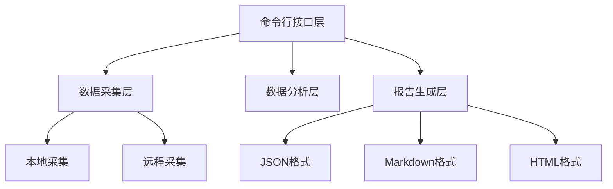
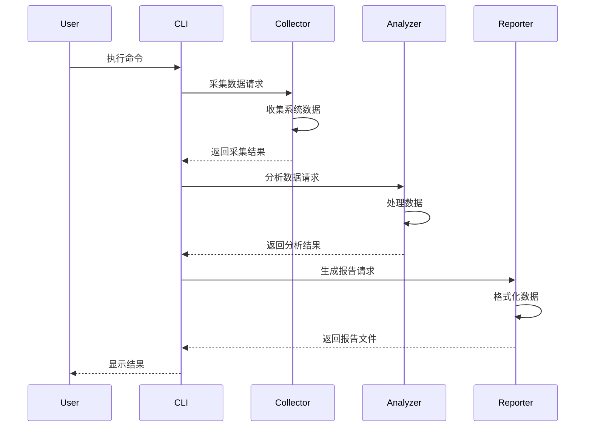

# 内存分析工具 - 初步设计

## 1. 系统架构

系统采用模块化的分层架构设计，分为以下几个主要层次：



### 1.1 命令行接口层 (CLI)

负责处理用户输入、参数解析和工作流程控制：
- 支持本地采集和远程采集模式
- 处理命令行参数和配置
- 协调各个模块的工作

### 1.2 数据采集层 (Collector)

负责从系统收集内存使用数据：
- 支持本地系统数据采集
- 支持通过SSH采集远程系统数据
- 处理进程信息和内存统计
- 数据序列化和存储

### 1.3 数据分析层 (Analyzer)

负责处理和分析采集到的数据：
- 比较两次采集的数据差异
- 识别内存变化
- 分类和聚合数据
- 生成分析结果

### 1.4 报告生成层 (Reporter)

负责将分析结果转换为多种格式的报告：
- JSON 格式：完整的原始数据
- Markdown 格式：可读性好的中文报告
- HTML 格式：响应式设计的可视化报告

## 2. 数据流向



## 3. 关键接口设计

### 3.1 数据采集接口

```rust
pub trait DataCollector {
    fn collect(&mut self) -> Result<CollectionResult>;
    fn collect_single_process(&self, pid: i32) -> Result<String>;
}
```

### 3.2 数据分析接口

```rust
pub trait DataAnalyzer {
    fn analyze(old: CollectionResult, new: CollectionResult) -> Result<MemoryDiff>;
}
```

### 3.3 报告生成接口

```rust
pub trait ReportGenerator {
    fn generate_report(&self, diff: &MemoryDiff, output_dir: &Path) -> Result<ReportFiles>;
}
```

## 4. 扩展性设计

系统的扩展性主要体现在以下几个方面：

### 4.1 数据采集扩展
- 支持添加新的数据源
- 可扩展采集的数据类型
- 支持不同的远程连接方式

### 4.2 分析能力扩展
- 支持添加新的分析算法
- 可扩展分析维度
- 支持自定义分析规则

### 4.3 报告格式扩展
- 支持添加新的报告格式
- 可自定义报告模板
- 支持多语言输出

## 5. 安全性考虑

### 5.1 权限控制
- 最小权限原则
- sudo 权限管理
- 文件访问控制

### 5.2 数据安全
- 敏感数据处理
- 数据完整性校验
- 错误处理机制

## 6. 性能考虑

### 6.1 并行处理
- 并行数据采集
- 异步IO操作
- 多线程分析

### 6.2 资源优化
- 内存使用优化
- 文件IO优化
- 计算效率优化
